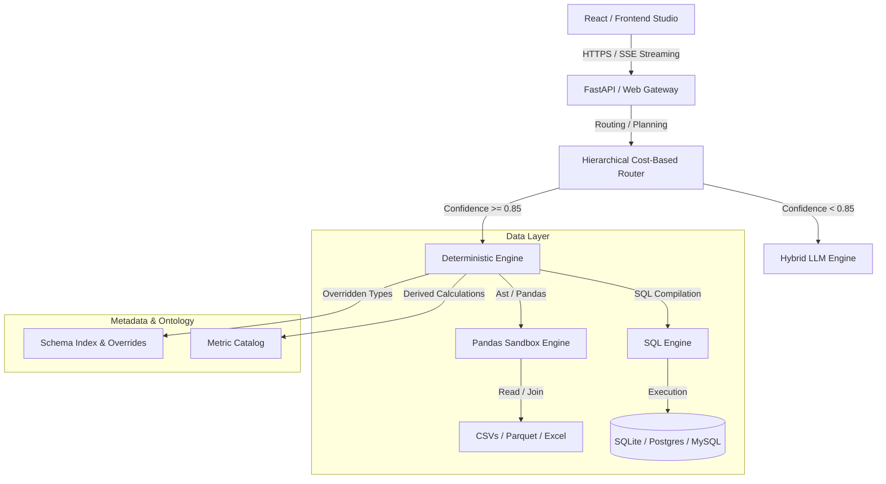
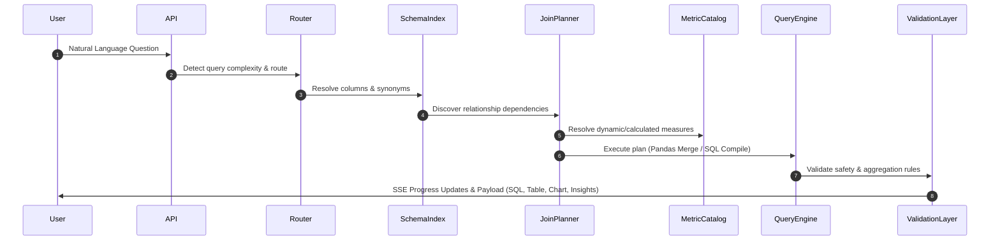

# QueryIQ AI Data Analytics Agent Architecture

QueryIQ acts as an intelligent enterprise analytics assistant that connects, models, joins, and interprets multiple structured and unstructured datasets using natural language.

---

## 1. Technology Stack Mapping

QueryIQ is built upon a modular stack designed for fast execution, high accuracy, and strict security isolation:

- **LLM Engine**: Dynamic prompting using Groq (Llama-3.3 / DeepSeek / Mixtral) for high-reasoning tasks.
- **Agent Orchestrator**: LangGraph-inspired cost-routing flow managed in `backend/services/router.py`.
- **Database Toolkit**: Default support for SQLite metadata stores, fully extensible to PostgreSQL, MySQL, and SQL Server via Python DB API connectors.
- **Visualization Layer**: Interactive Plotly-rendered dashboards and visual analytics.
- **Frontend Platform**: Vite + React + Tailwind-rendered studio UI.

---

## 2. Reasoning & Join Workflow

The orchestrator executes a multi-step reasoning loop to guarantee correct, performant, and trace-validated results:

### 1. Intent Detection & Schema Parsing
The query is rewritten (fixing typos and Hinglish terms) and matched deterministically via regex keywords, or mapped dynamically using `difflib.SequenceMatcher` token matching.

### 2. Multi-Dataset Relationship Mapping (`JoinPlanner`)
When a query references columns spanning multiple tables, `JoinPlanner` discovers dependencies, builds the shortest join path using the table graph, and outputs a single joined dataframe:
- Checks column-to-table mappings across all datasets.
- Traverses the relationship graph via the relationship engine.
- Merges datasets with appropriate join strategies (`left`, `inner`, suffix resolution).

### 3. Pre-Execution Validation
Before any code or SQL query runs, it is sent to the AST validator to protect against command injections, out-of-bounds calculations, and incompatible aggregations (e.g., executing `SUM` on a categorical `IDENTIFIER` column).

---

## 3. Standard Output Requirements

On successful execution, the API emits a Structured Response Payload containing:
1. **DSL & Code View**: The executed Python code block or compile-ready SQL statement.
2. **Data Preview**: Fast head preview of the execution result dataframe.
3. **Visualizations**: Rendered chart properties (bar, line, scatter, etc.).
4. **Insights & Narratives**: Structured, non-hallucinated explanations of the trends, anomalies, and key takeaways generated by the analysis.

---

## 4. Production Constraints & Safety Safeguards

To prevent incorrect insights or system failures, QueryIQ adheres to these strict constraints:
- **Zero Hallucination**: If a column cannot be resolved to the schema index or synonyms database, the engine rejects the direct route and forces a fallback to the clarification/LLM parser.
- **Dynamic Override Precedence**: Custom database semantic model mappings override default data type classification heuristics instantly.
- **Resource Limits**: Direct execution is protected by a peak RSS memory limit delta check ($\le 50\text{ MB}$) to prevent out-of-memory crashes on large production datasets.
