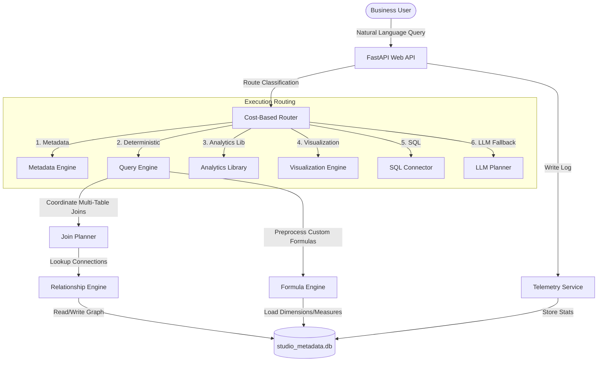

# QueryIQ Enterprise Architecture Documentation

This document describes the production-grade architecture of the QueryIQ Enterprise Edition BI platform.

---

## 1. System Architecture

---

## 2. Component Reference

### A. Relationship Discovery Engine
- **Module**: `backend.services.relationship_engine`
- **Functionality**: Automatically discovers PK/FK pairs by matching column naming patterns and calculating overlapping value distributions.
- **API**:
  - `GET /api/relationships`: Lists all registered relationships.
  - `GET /api/relationships/graph`: Returns the complete adjacency graph.
  - `POST /api/relationships/discover`: Triggers background relationship discovery.

### B. Automatic Join Planner
- **Module**: `backend.services.join_planner`
- **Functionality**: Uses BFS/DFS pathfinding on the relationship graph to resolve the shortest join path between tables and builds merged DataFrames on the fly.

### C. DAX-like Formula Engine
- **Module**: `backend.services.formula_engine`
- **Functionality**: A lightweight parser and compiler that translates DAX expressions (e.g. `DIVIDE(SUM(Profit), SUM(Sales))`, `RUNNING_TOTAL(Sales)`) into vectorized Pandas executions.

### D. Observability & Telemetry
- **Module**: `backend.services.telemetry`
- **Functionality**: Monitored stats covering CPU usage, process memory footprint, query execution latencies, and success distributions.
