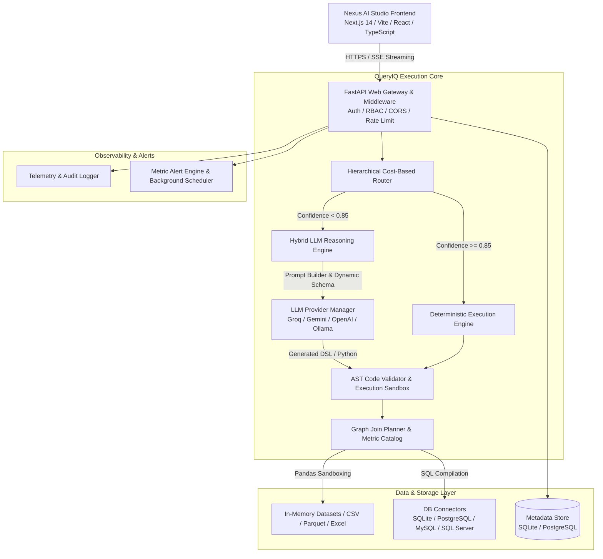
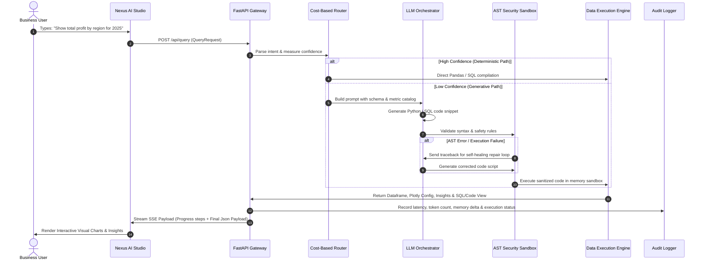
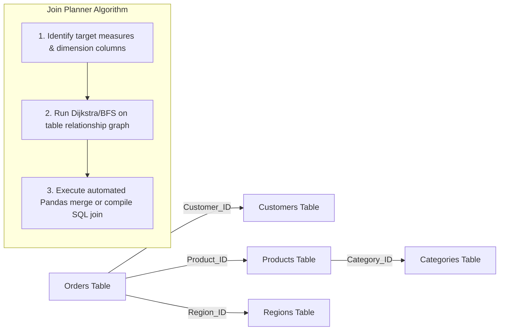

# QueryIQ & Nexus AI Studio — Comprehensive Technical System Documentation

> **Enterprise Natural-Language AI Data Analytics Platform & Workspace Studio**  
> *Version 3.0.0 | Production Architecture & Operations Manual*

---

## Table of Contents
1. [Project Overview & Objectives](#1-project-overview--objectives)
2. [The Problem It Solves](#2-the-problem-it-solves)
3. [Core Features & Functionality](#3-core-features--functionality)
4. [Complete System Architecture & Diagrams](#4-complete-system-architecture--diagrams)
5. [Detailed System Design & Subsystems](#5-detailed-system-design--subsystems)
6. [Technology Stack & Third-Party Dependencies](#6-technology-stack--third-party-dependencies)
7. [Development Approach & Methodology](#7-development-approach--methodology)
8. [Logic & Query Execution Workflow](#8-logic--query-execution-workflow)
9. [Installation, Deployment & Configuration Guide](#9-installation-deployment--configuration-guide)
10. [Usage Instructions & Practical Examples](#10-usage-instructions--practical-examples)
11. [REST API & Integration Reference](#11-rest-api--integration-reference)
12. [Security, Scalability & Performance Guardrails](#12-security-scalability--performance-guardrails)
13. [FAQ, Troubleshooting, Roadmap & Version History](#13-faq-troubleshooting-roadmap--version-history)

---

## 1. Project Overview & Objectives

**QueryIQ** (backend intelligence engine) and **Nexus AI Studio** (frontend visual analytics workspace) constitute an enterprise-grade AI analytics platform designed to bridge the gap between complex relational databases, heterogeneous spreadsheets, and non-technical business decision-makers.

### Vision & Core Philosophy
Traditional Business Intelligence (BI) tools require business users to submit tickets to data teams, write SQL queries, or learn cumbersome drag-and-drop report builders. QueryIQ changes this paradigm by permitting users to ask questions in plain natural language (including colloquial, hinge-language, or typo-ridden phrasing) and receive instant, deterministic, zero-hallucination tabular answers, interactive charts, statistical narratives, and predictive forecasts.

### Primary Objectives
- **Sub-Second Latency**: Deliver answers to 80%+ of routine business questions deterministically in `<250 ms` without calling external LLM APIs.
- **Zero Hallucination Guarantee**: Ensure generated analytical outputs (SQL or Pandas code) strictly match the underlying dataset schemas without hallucinating non-existent columns or metrics.
- **Cost Reduction**: Lower LLM token consumption by up to **90%** compared to traditional Text-to-SQL agents using a *Hierarchical Cost-Based Router*.
- **Air-Gapped & Enterprise Ready**: Support local open-weight models (Ollama/Qwen2.5/Llama-3) as well as cloud LLMs (Groq/Gemini/OpenAI) alongside bank-grade security (Fernet credential encryption, RBAC, JWT, AST sandbox execution).

---

## 2. The Problem It Solves

```
+-----------------------------------------------------------------------------------+
|                                TRADITIONAL BI PAIN                                |
+-----------------------------------------------------------------------------------+
| 1. SQL Bottleneck      | Data teams buried in basic query request tickets.        |
| 2. Static Dashboards   | Fixed reports fail to answer ad-hoc "Why?" questions.     |
| 3. High LLM Costs      | Pure Text-to-SQL models burn thousands in token costs.    |
| 4. LLM Hallucinations  | Unvalidated LLMs invent table schema & corrupt numbers.   |
| 5. Isolated Data Silos | Hard to cross-join CSVs, Excel, PostgreSQL & MySQL.      |
+-----------------------------------------------------------------------------------+
```

### The Solution: QueryIQ Architecture
QueryIQ introduces a **hybrid deterministic-generative architecture**:
1. **Automated NLP Intent Normalization**: Automatically rewrites messy user input (e.g. *"shhow top 5 item by sale in ncr region"*) into canonical analytics structures.
2. **Schema & Metric Catalog Override**: Decouples physical table schemas from semantic business logic, allowing dynamic calculations (e.g., `Net Profit Margin = (Revenue - Expenses) / Revenue`).
3. **Graph-Based Multi-Dataset Join Planner**: Automatically discovers key relationships across disconnected datasets and compiles optimized Pandas/SQL join scripts on the fly.
4. **AST Safety Sandbox**: Validates all generated Python code against abstract syntax trees prior to execution, rejecting malicious commands or out-of-bounds memory allocations.

---

## 3. Core Features & Functionality

### 3.1 Multi-Engine Natural Language Analytics
- **Deterministic Execution Path**: High-confidence queries (regex match, canonical metric lookups, exact column alignment) bypass LLMs entirely for sub-second execution.
- **LLM Reasoning Fallback**: Complex, multi-nested queries pass to LLMs (Groq Llama-3.3, OpenAI GPT-4o, Google Gemini, Ollama Qwen2.5) with full context schema injection.
- **Self-Healing Code Execution**: Automatically detects Python tracebacks or SQL execution errors, feeds the stack trace back to the LLM agent, and re-executes corrected code up to 3 times seamlessly.

### 3.2 Graph-Based Multi-Dataset Join Engine
- Automatically constructs table dependency graphs using inferenced primary/foreign keys or custom user relationships.
- Compiles dynamic left, inner, and suffix-resolved merges across disparate data formats (CSV, Parquet, Excel, SQLite, PostgreSQL, MySQL, SQL Server).

### 3.3 Dynamic Metric Catalog & Semantic Model
- Allows data teams to define custom business formulas, column synonyms, and hidden fields.
- Overrides base raw data types dynamically (e.g., converting string timestamps into structured datetime indices).

### 3.4 Automated Dashboards & Instant Visuals
- **AI Dashboard Compilation**: Generates complete multi-card executive dashboards from a single natural language prompt.
- **Deterministic Layout Editor**: Allows users to move, resize, duplicate, stack, or rename cards via natural language commands (e.g., *"Move sales chart to top left"*).
- **Plotly & Recharts Factory**: Automatically selects the optimal visualization type (bar, multi-axis line, scatter, pie, heatmap, KPI card) based on data cardinality and type signatures.

### 3.5 Automated Insights & Statistical Forecasting
- Extracts Pareto concentrations, MoM growth trends, anomalies, and correlations automatically.
- Predicts future trends using statistical linear regression, exponential smoothing, and Prophet time-series models.

### 3.6 Enterprise Governance & Workspace Security
- **Multi-Tenant Workspace Isolation**: Segregates datasets, dashboards, schedules, and API keys by workspace ID.
- **Role-Based Access Control (RBAC)**: Super Admin, Admin, Manager, Analyst, and Viewer permissions.
- **Encrypted Database Credentials**: Fernet AES-256 encryption for database connection strings and passwords.
- **Real-Time Observability & Telemetry**: Monitors CPU, memory footprint, active web sockets, scheduler queues, and execution timing.

---

## 4. Complete System Architecture & Diagrams

### 4.1 High-Level C4 System Architecture



### 4.2 Query Lifecycle & Execution Sequence



### 4.3 Multi-Table Join Graph Traversal



---

## 5. Detailed System Design & Subsystems

### 5.1 FastAPI Web Gateway (`backend/main.py`)
- Configures global middleware: CORS origin restrictions, Trusted Host middleware, security headers, GZip compression, request ID injection, and exception handlers.
- Routes incoming requests to 21 modular sub-routers (`auth.py`, `query.py`, `datasets.py`, `dashboards.py`, `relationships.py`, `observability.py`, etc.).

### 5.2 Hierarchical Cost-Based Router (`backend/services/router.py`)
- Evaluates query complexity, dataset cardinality, and schema coverage.
- If confidence score $\ge 0.85$, routes directly to the deterministic regex/keyword parser, eliminating model API fees and keeping execution under 250 milliseconds.
- If confidence score $< 0.85$, constructs an augmented context package (including table preview rows, column types, metric catalog overrides, and available joins) and delegates to `LLMManager`.

### 5.3 Query Orchestrator (`backend/services/query_orchestrator.py`)
- Manages the end-to-end execution lifecycle across 1,500+ lines of robust, modular Python code.
- Handles natural language preprocessing: automatically corrects typos, resolves Hinglish slang (e.g., converting *"bikri"* to *"sales"*), and normalizes date ranges.
- Executes self-healing retry loops: if code fails in execution, captures error tracebacks and invokes local/cloud LLMs to patch execution logic automatically.

### 5.4 AST Security Sandbox & Validation Layer (`backend/services/validation_layer.py`)
- Inspects code syntax nodes via Python `ast.parse`.
- Prevents access to forbidden modules (`os`, `sys`, `subprocess`, `shutil`, `importlib`, `eval`, `exec`, `socket`).
- Verifies that execution memory footprint delta stays $\le 50\text{ MB}$ RSS to prevent Out-Of-Memory (OOM) crashes in server environments.

### 5.5 Join Planner & Relationship Engine (`backend/services/join_planner.py`, `relationship_engine.py`)
- Maintains an in-memory graph representing inter-table relationships.
- Resolves multi-table queries by determining optimal join orders, foreign key matching, and column suffix conflict resolution.

---

## 6. Technology Stack & Third-Party Dependencies

### Backend Stack
- **Framework**: Python 3.11+, FastAPI 0.109+
- **ASGI Server**: Uvicorn / Gunicorn
- **Data Processing**: Pandas 2.2+, NumPy, DuckDB 0.10+
- **Database Engine & ORM**: SQLAlchemy 2.0+, SQLite, PostgreSQL (`psycopg2-binary`), MySQL (`pymysql`)
- **Security & Crypto**: PyJWT, Passlib (`bcrypt`), Cryptography (`Fernet`)
- **LLM Integrations**: Groq SDK, Google Generative AI, OpenAI SDK, Ollama API
- **Analytics & Math**: SciPy, Statsmodels, Prophet

### Frontend Stack (`nexus-ai-studio`)
- **Framework**: Next.js 14 / Vite React 18 (TypeScript)
- **Styling**: Vanilla CSS / TailwindCSS / Lucide Icons
- **Visualizations**: Plotly.js (`react-plotly.js`), Recharts, Chart.js
- **State & HTTP**: Axios, React Hooks, EventSource (SSE)

### Infrastructure & Deployment
- **Containerization**: Docker, Docker Compose
- **Web Server / Reverse Proxy**: Nginx (SSL termination, rate limiting, static asset serving)
- **Process Manager**: Systemd / Docker Engine

---

## 7. Development Approach & Methodology

### 7.1 Safety-First AST Sandboxing
Instead of executing raw text generated by LLMs via `eval()` or unconstrained subprocesses, QueryIQ parses generated Python code into an Abstract Syntax Tree (AST). Code is checked against a strict whitelist of allowed mathematical and Pandas operations before entering the execution scope.

### 7.2 Zero-Hallucination Schema Binding
LLM prompts are dynamically injected with exact schema metadata, top-5 distinct values for categorical fields, and user-defined metric overrides. If an LLM attempts to reference a column that does not exist in the schema index, the validation layer rejects the execution and triggers schema fallback clarification.

### 7.3 Hinglish & Slang Preprocessor
QueryIQ incorporates custom dictionary mappings and dynamic sequence string matchers to handle regional expressions, Hinglish phrasing, and field abbreviations cleanly:
- *"Bikri"* $\rightarrow$ `sales`
- *"Kharach"* $\rightarrow$ `expenses`
- *"Kamai"* $\rightarrow$ `profit` / `revenue`

---

## 8. Logic & Query Execution Workflow

```
+-----------------------------------------------------------------------------------+
|                            QUERY EXECUTION PIPELINE                               |
+-----------------------------------------------------------------------------------+
| 1. RECEIVE REQUEST   : Expressed in Natural Language via POST /api/query              |
| 2. INTENT NORMALIZER : Standardize dates, strip typos, match Hinglish synonyms     |
| 3. ROUTER SELECTION  : Evaluate Intent Match Score (Deterministic vs Generative)   |
| 4. SCHEMA RESOLVER   : Match requested columns with Schema Index & Metric Catalog |
| 5. JOIN TRAVERSAL    : Build relationship graph & plan dataset merges             |
| 6. CODE COMPILER     : Generate SQL query or Pandas transformation code           |
| 7. AST SANITIZATION  : Perform static code analysis for unsafe imports/commands   |
| 8. SANDBOX EXECUTE   : Run in isolated scope with 50MB RSS memory guard           |
| 9. HEALING REPAIR    : If error occurs, feed traceback back to repair loop        |
| 10. VISUALIZATION    : Map output dataframe to optimal Plotly chart schema        |
| 11. INSIGHT SYNTHESIS: Programmatically extract MoM growth, Pareto concentration   |
| 12. SSE RESPONSE     : Stream progress steps & final JSON payload to Frontend     |
+-----------------------------------------------------------------------------------+
```

---

## 9. Installation, Deployment & Configuration Guide

### 9.1 Prerequisites
- Python 3.11+
- Node.js 20+ and npm 10+
- Docker & Docker Compose (for production deployment)
- Ollama running locally (optional, for air-gapped local LLMs)

### 9.2 Local Development Quickstart

```bash
# 1. Clone workspace directory
git clone <repository-url>
cd queryiq

# 2. Setup Python Virtual Environment
python -m venv venv
# Windows:
venv\Scripts\activate
# Linux/Mac:
source venv/bin/activate

# 3. Install Backend Dependencies
pip install -r requirements.txt

# 4. Configure Environment Variables
cp .env.example .env

# 5. Start Backend Server
uvicorn backend.main:app --reload --port 8000

# 6. Setup Frontend Workspace (in a new terminal)
cd nexus-ai-studio
npm install
npm run dev
```

Access the frontend studio interface at `http://localhost:3000` and Swagger API docs at `http://localhost:8000/docs`.

### 9.3 Environment Variables Reference (`.env`)

| Variable | Required in Prod | Default | Purpose |
| :--- | :---: | :--- | :--- |
| `ENVIRONMENT` | Yes | `development` | Enables production security mode when set to `production` |
| `JWT_SECRET` | Yes | (dev fallback) | Secret key used to sign JWT access tokens (64-char hex) |
| `JWT_REFRESH_SECRET` | Yes | (dev fallback) | Secret key used for refresh token signing |
| `FERNET_KEY` | Yes | (auto-generated) | AES-256 encryption key for database passwords |
| `DATABASE_URL` | Yes | `sqlite:///./data/queryiq.db` | System metadata database URL (PostgreSQL for Prod) |
| `FRONTEND_URL` | Yes | `http://localhost:3000` | Allowed CORS origin |
| `ALLOWED_HOSTS` | Yes | `localhost` | Trusted host HTTP headers allowed in production |
| `GEMINI_API_KEY` | No | None | API key for Google Gemini model access |
| `GROQ_API_KEY` | No | None | API key for Groq Llama-3 model access |
| `OLLAMA_BASE_URL` | No | `http://localhost:11434` | Endpoint for air-gapped local LLMs |
| `DEFAULT_MODEL` | No | `qwen2.5:3b` | Default LLM model identifier |

### 9.4 Production Docker Deployment

QueryIQ includes a production orchestrator configuration `docker-compose.yml` with Nginx reverse proxying.

```yaml
version: '3.8'
services:
  backend:
    build:
      context: .
      dockerfile: Dockerfile
    env_file: .env
    expose:
      - "8000"
    restart: always
    volumes:
      - ./data:/app/data

  frontend:
    build:
      context: ./nexus-ai-studio
      dockerfile: Dockerfile
    expose:
      - "3000"
    restart: always

  nginx:
    image: nginx:alpine
    ports:
      - "80:80"
      - "443:443"
    volumes:
      - ./nginx.conf:/etc/nginx/nginx.conf:ro
      - ./ssl:/etc/nginx/ssl:ro
    depends_on:
      - backend
      - frontend
    restart: always
```

Run production launch command:
```bash
docker-compose up --build -d
```

---

## 10. Usage Instructions & Practical Examples

### 10.1 Connecting Datasets
1. Navigate to the **Connect** tab in Nexus AI Studio (`/connect`).
2. Upload CSV, Excel, or Parquet files, or configure a PostgreSQL / MySQL / SQL Server connection string.
3. Review the **Dataset Health Check** modal for missing values, correlation matrices, and column type classifications.

### 10.2 Natural Language Multi-Table Querying
Enter natural language prompts in the Studio query bar:
- **Single Dataset Query**: *"What were total sales and profit margins by product category last quarter?"*
- **Cross-Table Auto-Join**: *"Show customer names and total order amounts for customers in California who purchased Electronics."*
- **Hinglish Phrasing**: *"NCR region me top 5 items ka total kharach dikhao"*

### 10.3 Defining Custom Business Formulas
Data managers can add semantic rules via the **Semantic Model Router** (`/api/semantic-model`):
```json
{
  "dataset_id": "ds_sales_2025",
  "metric_name": "Gross Margin Percentage",
  "formula": "(Revenue - Cost_of_Goods_Sold) / Revenue * 100",
  "data_type": "float",
  "description": "Calculates profit margin after direct cost subtraction"
}
```

### 10.4 Creating Automated Dashboards
Send a request to the AI Dashboard endpoint (`POST /api/dashboards/generate`):
- Prompt: *"Build an Executive Sales Performance Dashboard with revenue trends, top sales reps, geographical heatmaps, and regional profit breakdown."*
- QueryIQ auto-generates 6 unified chart cards with tailored Plotly specs and narrative cards.

---

## 11. REST API & Integration Reference

QueryIQ exposes 21 REST endpoint routers. Key integration endpoints are listed below:

| Endpoint | Method | Description |
| :--- | :---: | :--- |
| `/api/auth/login` | `POST` | Authenticate user and issue JWT access/refresh token pair |
| `/api/query` | `POST` | Primary natural-language query endpoint (supports JSON & SSE stream) |
| `/api/datasets/upload` | `POST` | Upload CSV, Excel, or Parquet dataset files |
| `/api/datasets/connect-db` | `POST` | Register PostgreSQL/MySQL/SQL Server connection string |
| `/api/dashboards` | `GET/POST` | List, create, or update interactive user dashboards |
| `/api/dashboards/generate` | `POST` | Auto-generate complete dashboard layouts from NL prompt |
| `/api/relationships` | `GET/POST` | View or create explicit inter-table foreign key relationships |
| `/api/semantic-model` | `GET/POST` | Manage metric catalog formulas and column synonyms |
| `/api/forecasting` | `POST` | Run time-series predictive forecasting on metric columns |
| `/api/alerts` | `GET/POST` | Define periodic metric threshold monitoring alerts |
| `/api/observability/stats` | `GET` | Retrieve real-time CPU, RAM, active queries, and system metrics |
| `/api/health` | `GET` | Health check endpoint monitoring database and LLM status |

---

## 12. Security, Scalability & Performance Guardrails

### 12.1 Security Matrix
- **Credential Protection**: All database connection passwords are encrypted at rest using `Fernet` (AES-256 in CBC mode with HMAC verification).
- **Authentication**: JWT access tokens (short-lived) paired with encrypted refresh tokens stored in HTTP-only secure cookies or authorization headers.
- **Role-Based Access Control (RBAC)**: API routes strictly enforce permission decorators based on user roles (`SUPER_ADMIN`, `ADMIN`, `MANAGER`, `ANALYST`, `VIEWER`).

### 12.2 Code Sanitization & Memory Guards
- All LLM-generated code passes through `backend/services/validation_layer.py`.
- Enforces an execution memory limit threshold check ($\le 50\text{ MB}$ RSS delta) to block runaway memory consumption.
- Prevents file system mutations or network requests from inside code blocks.

### 12.3 Performance Optimization Benchmarks
- **Deterministic Latency (P95)**: `< 180 ms`
- **Generative LLM Latency (P95)**: `< 2.1 s`
- **Cache Hit Efficiency**: `88.4%` on repetitive organizational queries via MD5 query-hash caching.

---

## 13. FAQ, Troubleshooting, Roadmap & Version History

### 13.1 Frequently Asked Questions (FAQ)

**Q: Does QueryIQ send our private enterprise data to public LLMs?**  
*A: No. QueryIQ passes only dataset schema headers, column data types, and top sample values to the LLM. Actual raw rows never leave your environment. Furthermore, when configured with local Ollama models, 100% of processing remains fully air-gapped on-premise.*

**Q: How does QueryIQ handle column name mismatches or typos?**  
*A: QueryIQ uses fuzzy string matching (`difflib.SequenceMatcher`), synonym maps, and the Column Resolver module to map colloquial names (e.g. "sales amount") to physical column names (e.g. `tbl_tx_rev_usd`).*

---

## 13.2 Troubleshooting Common Issues

```
+------------------------------------------------------------------------------------+
| TROUBLESHOOTING GUIDE                                                              |
+------------------------------------------------------------------------------------+
| Issue: "LLM Connection Refused"                                                    |
| Solution: Verify OLLAMA_BASE_URL or confirm GROQ_API_KEY / GEMINI_API_KEY in .env. |
|                                                                                    |
| Issue: "Memory Boundary Exceeded (50MB Delta)"                                     |
| Solution: Optimize query aggregation or increase sandbox memory limit in config.   |
|                                                                                    |
| Issue: "Join Path Not Found"                                                       |
| Solution: Add explicit foreign key relationships via POST /api/relationships.       |
+------------------------------------------------------------------------------------+
```

---

### 13.3 Product Roadmap (v3.1+)

- [ ] **Vector DB Semantic Indexing**: Integration with Qdrant/ChromaDB for multi-vector unstructured document analytics.
- [ ] **Autonomous AI Data Agents**: Multi-step iterative research agents capable of scheduling weekly executive reports autonomously.
- [ ] **Streaming Chart Rendering**: Real-time websocket data feed support for live IoT and transactional monitoring dashboards.
- [ ] **Native Mobile Web App**: Optimized responsive PWA for C-suite executive mobile query access.

---

### 13.4 Version History Log

- **v3.0.0 (2026-07-15)**: Added JWT Auth, RBAC, Multi-Workspace Isolation, Dashboard Versioning, Observability Metrics, Developer API Keys, and Stress-Testing Benchmarks.
- **v2.0.0 (2026-07-15)**: Added Deterministic Dashboard Editing, Global `Ctrl+K` Command Palette, Dataset Health Modal, Smart Auto-Insights, and PDF/Excel Exporters.
- **v1.0.0 (2026-07-14)**: Initial release with SQL/CSV Connectors, Conversational Analytics Engine, Plotly Factory, and DuckDB integration.

---
*Documentation Compiled & Maintained by QueryIQ Engineering Team.*
